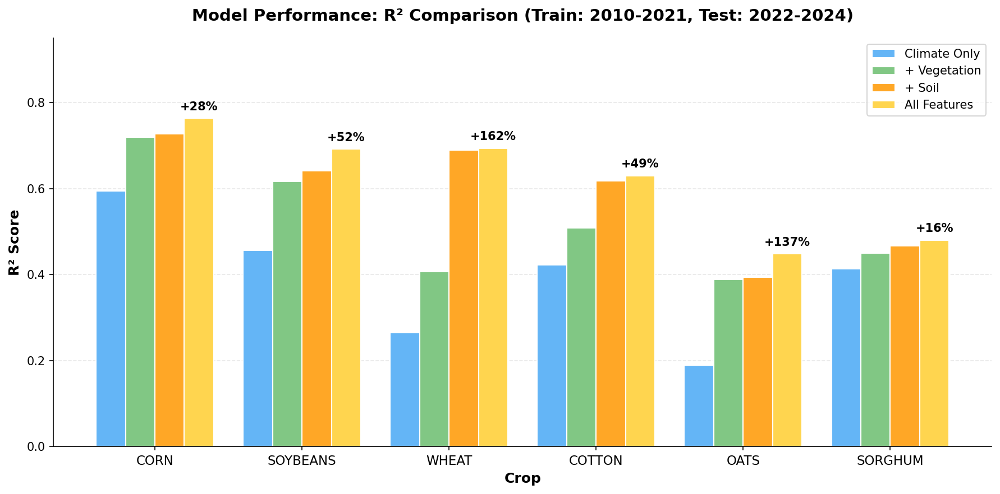
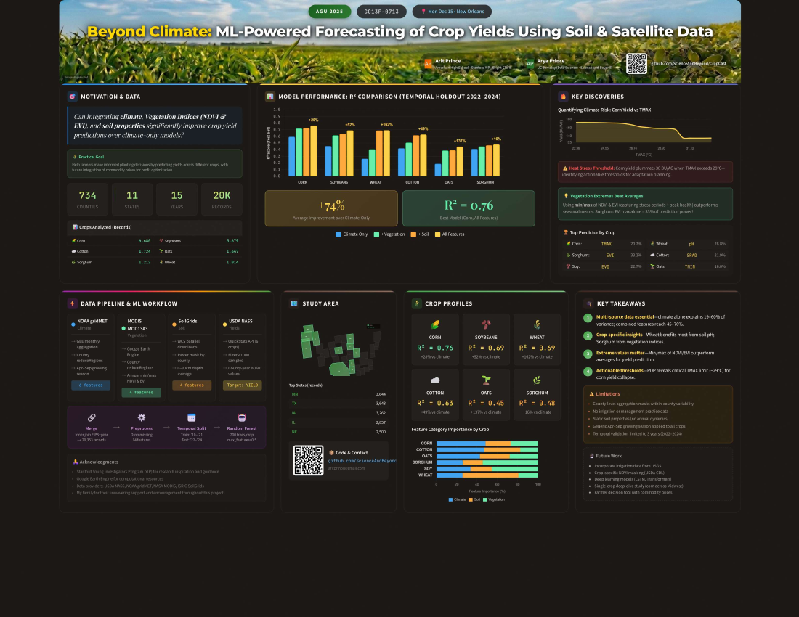

# CropCast

Predicting U.S. crop yields using machine learning with climate, satellite vegetation indices, and soil data.

---

## What this project does

We wanted to see if adding soil and vegetation data could improve crop yield predictions beyond just using climate data. Turns out it really does — our models improved by ~70% on average when we combined everything.

## Results



---

## Data sources

We used 4 data sources covering 734 counties across 11 states from 2010-2024:

| Data | Source | What It Provides |
|------|--------|------------------|
| Crop yields | USDA NASS QuickStats | Bushels per acre by county/year |
| Climate | gridMET via Google Earth Engine | Temperature, precipitation, solar radiation (4km grid, derived from NOAA stations) |
| Vegetation | MODIS NDVI/EVI via Google Earth Engine | Satellite-based crop health indices |
| Soil | ISRIC SoilGrids | Bulk density, pH, organic carbon, clay content |

See `data/README.md` for details on each file.

---

## Project structure

```
CropCast/
├── src/
│   ├── config.py              # File paths and settings
│   ├── utils.py               # Helper functions
│   ├── download_yields.py     # USDA NASS crop yield data
│   ├── download_climate.py    # gridMET via GEE
│   ├── download_vegetation.py # MODIS via GEE
│   ├── download_soil.py       # SoilGrids API
│   └── ml.py                  # ML pipeline
│
├── data/
│   ├── raw/                   # Downloaded data before cleaning
│   └── processed/             # ML-ready datasets
│
├── results/                   # Model outputs
│   ├── model_performance.csv
│   └── feature_importance/
│
└── poster/                    # AGU 2025 materials
```

---

## How to run

```bash
git clone https://github.com/ScienceAndBeyond/CropCast.git
cd CropCast
pip install -r requirements.txt
```

To download fresh data (needs API keys in `.env`):
```bash
python src/download_yields.py --states MN IA IL --start-year 2010 --end-year 2024
python src/download_climate.py --states MN IA IL --start-year 2010 --end-year 2024
python src/download_vegetation.py --states MN IA IL --start-year 2010 --end-year 2024
python src/download_soil.py --states MN IA IL
```

To train models:
```bash
python src/ml.py
```

---

## Requirements

- Python 3.9+
- pandas, scikit-learn, numpy
- Google Earth Engine account (for climate and vegetation data)

---

## Poster

Presented at AGU 2025, New Orleans (GC13F-0713).

[](poster/AGU2025_CropCast_Poster.pdf)

---

## Limitations

- County-level data (masks field-level variation)
- Static soil properties (no year-to-year changes)
- A generic growing season of Apr–Sept was used across all crops

## Roadmap

- [ ] Add irrigation data from USGS
- [ ] Crop-specific vegetation masking using AI or other sources
- [ ] Crop-specific growing season

---

## Authors

- Arit Prince
- Arya Prince

---

## Contact

Questions or ideas?
- Open an [Issue](https://github.com/ScienceAndBeyond/CropCast/issues)
- Or reach us through our [GitHub profile](https://github.com/ScienceAndBeyond)

---

If you use this, a citation would be appreciated:

```
Prince, A. & Prince, A. (2025). CropCast: Multi-source crop yield prediction.
GitHub: https://github.com/ScienceAndBeyond/CropCast
```
