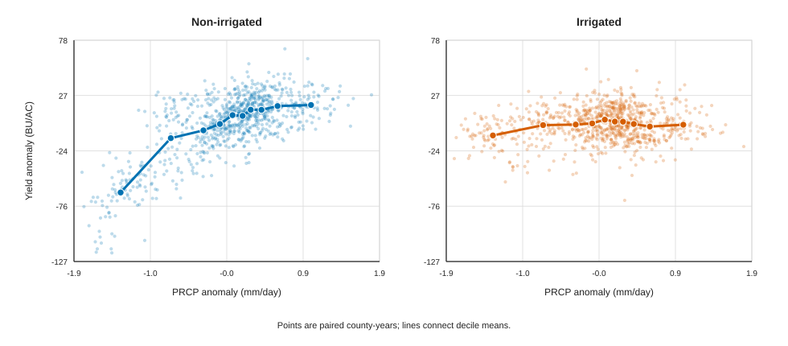
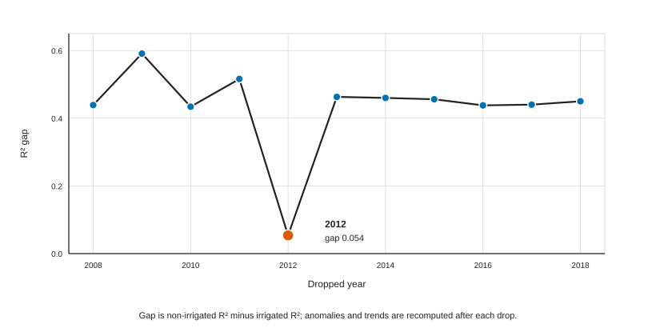
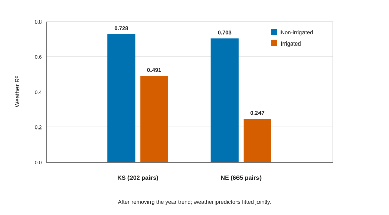

# Irrigation Is Associated With Weaker Weather-Yield Links in Kansas and Nebraska Corn Counties, 2008-2018

Arit Prince

ORCID: https://orcid.org/0009-0006-2610-4440

Affiliation: Independent researcher

Corresponding author: aritprince@scienceandbeyond.org

This manuscript is a non-peer-reviewed preprint.

Keywords: corn yield; irrigation; weather anomalies; drought; county-level agriculture; USDA NASS; gridMET

## Abstract

USDA NASS reported county-level corn yields separately for irrigated and non-irrigated production practices in selected counties through 2018. This study uses same-county, same-year pairs from Kansas and Nebraska to test whether irrigated yields were less tied to growing-season weather than non-irrigated yields. Across 867 paired county-years from 114 counties, the weather model accounted for 68.5% of the year-to-year movement in non-irrigated yield, but only 16.6% for irrigated yield. A county-held-out check, in which the model is tested on counties it was not fitted on, gave similar estimates of 68.0% and 15.2%. Single-weather slopes and correlations were also smaller for irrigated yields. However, the contrast depended strongly on the 2012 drought: dropping 2012 reduced the R² gap after removing the year trend from 0.446 to 0.054. These results support a descriptive association between irrigation status and weaker weather-yield links in selected Kansas and Nebraska reporting counties, especially during severe drought, but they do not prove that irrigation caused the difference.

## Research Question and Main Finding

In selected Kansas and Nebraska county-years where both irrigated and non-irrigated corn yields were reported, the weather model accounted for much more year-to-year movement in non-irrigated yields than irrigated yields. The contrast was strongest in the severe 2012 drought year and much weaker when 2012 was omitted.

The direction of this result is expected: irrigation should reduce dependence on rainfall and drought stress. The contribution of this paper is to measure the size of that difference in paired county-level USDA data and show how strongly it depends on one severe drought year.

## 1. Introduction

Corn yield changes with water supply, heat exposure, and how dry the air is during the growing season. Prior county-level work has shown strong nonlinear yield responses to high temperature in U.S. corn [@schlenker2009]. Great Plains studies have also linked corn yield to precipitation, extreme heat, evapotranspiration, and irrigation water availability [@payero2006; @ye2017]. The 2012 drought made these weather-yield links especially visible across central North America [@blunden2013].

Recent irrigation studies show why the direction of this result is expected, but they also show why the size is worth measuring. Irrigation can reduce year-to-year yield variability, weaken water and heat stress, and buffer yields during dry weather [@kukal2020; @luan2021; @zhu2022; @deines2026]. Here, I use public NASS split-yield reports for a focused paired county-year comparison.

This study builds on the CropCast AGU 2025 project [@prince2025cropcast]. It uses the same county-level yield and weather data pipeline but asks a different question. The earlier project focused on multi-source yield prediction. This paper focuses on whether irrigated and non-irrigated corn yields differ in how closely they move with weather anomalies.

Irrigation should reduce dependence on rainfall and soften the effect of hot, dry weather. But comparing irrigated and rainfed counties is difficult because irrigation is not randomly placed. Irrigated counties can differ from rainfed counties in soils, aquifers, farm systems, and climate.

This paper uses a narrower comparison. In some county-years, USDA NASS reports both irrigated and non-irrigated corn yields for the same county and year. Those two yield records share the same county-level weather data. They may still come from different fields, farmers, soils, seed varieties, planting dates, and water access within the county. So the design reduces some geography-based differences, but it does not remove selection bias, since farmers choose whether to irrigate rather than being assigned at random.

The central question is whether, in these paired county-years, non-irrigated yield changes are more strongly linked to growing-season weather changes than irrigated yield changes. The analysis is descriptive for counties that repeatedly report both practices. It is not treated as a randomized or causal irrigation effect.

## 2. Data

County corn yields come from USDA NASS Quick Stats [@usda_nass_quickstats]. The analysis uses records where `prodn_practice_desc` separates irrigated from non-irrigated corn and where both practices are reported in the same county-year. Weather variables come from gridMET [@abatzoglou2013], accessed through Google Earth Engine [@gorelick2017] and grouped into the state growing season used by the CropCast pipeline. The four weather features are precipitation rate (`PRCP`), extreme heat from maximum temperature (`EDD_TMAX`), vapor pressure deficit (`VPD`, how dry the air is), and maximum temperature (`TMAX`).

The yield panel covers 2008-2018 because NASS discontinued county estimates based on irrigated and non-irrigated practices beginning with the 2019 crop year [@usda_nass_discontinue2020]. The weather data continue after 2018, but the paired yield comparison does not. The analysis starts with complete same-county-year irrigated/non-irrigated pairs, keeps rows with complete weather coverage, and then requires each county to contribute at least four paired years. After that filter, only Kansas and Nebraska remain.

**Table 1. Sample construction**

| State | Complete pairs | After climate join and coverage | After ≥4 paired years | Counties after filter |
| --- | ---: | ---: | ---: | ---: |
| KS | 264 | 264 | 202 | 36 |
| ND | 10 | 10 | 0 | 0 |
| NE | 681 | 681 | 665 | 78 |
| SD | 34 | 34 | 0 | 0 |
| Total | 989 | 989 | 867 | 114 |

The final paired sample is Nebraska-heavy: Nebraska contributes 665 of 867 paired county-years, while Kansas contributes 202.

## 3. Methods

For each retained county-year, the analysis puts the irrigated and non-irrigated NASS yield records side by side. Then it subtracts each county's average from each yield and weather value. These centered values are called anomalies. They show whether a county-year was above or below that county's usual level:

zₐ(c,t) = z(c,t) - mean_c(z)

The main models predict yield anomalies from the four weather anomalies. Separate models are fitted for irrigated and non-irrigated corn:

yieldₐ = β₀ + β₁ PRCPₐ + β₂ EDD_TMAXₐ + β₃ VPDₐ + β₄ TMAXₐ + ε

The analysis reports two R² values. The first is in-sample R², which measures how much variation the weather model accounts for in the same data used to fit it. The second is county-held-out R². In that check, whole counties are assigned to five folds. For each fold, the model is fit on the training counties and tested on the held-out counties, so repeated years from the same county do not appear on both sides of the split. The anomaly values are still defined using each county's own time series, so this check tests whether the within-county pattern holds up when whole counties are left out. It is not a pure test of predicting a brand-new county from scratch. A second version removes the overall year trend before fitting. This is a simple detrending step, meaning it takes out the broad upward or downward movement shared across years before measuring the weather link.

Single-weather slopes are estimated with centered anomalies. These slopes are descriptive links, not true crop-response equations. For each weather feature, 95% bootstrap intervals are estimated by resampling whole counties 2,000 times, keeping each county's paired years together. The slope ratio is `abs(irrigated slope) / abs(non-irrigated slope)`. The correlation ratio makes the same comparison without units.

The drought check reruns the models after dropping one year at a time. The state check reruns the full workflow separately for Kansas and Nebraska. A final check gives Kansas and Nebraska equal total weight, so Nebraska's larger number of rows cannot dominate the result by itself.

All analysis outputs are generated by `src/irrigation_contrast.py`. Paper tables can be regenerated by `paper/paper_numbers.py`, and figures by `paper/make_irrigation_figures.py`.

## 4. Results

The weather model accounted for much more year-to-year movement in non-irrigated yield than in irrigated yield. Before removing the year trend, the in-sample weather R² was 0.685 for non-irrigated corn and 0.166 for irrigated corn. Holding out whole counties gave nearly the same contrast: 0.680 versus 0.152.

**Table 2. Weather R² by practice**

| Year-trend adjustment | Practice | In-sample R² | County-held-out R² | Mean yield | SD anomaly |
| --- | --- | ---: | ---: | ---: | ---: |
| No | Irrigated | 0.166 | 0.152 | 190.3 | 15.28 |
| No | Non-irrigated | 0.685 | 0.680 | 108.9 | 29.54 |
| Yes | Irrigated | 0.253 | 0.237 | 190.3 | 13.87 |
| Yes | Non-irrigated | 0.699 | 0.695 | 108.9 | 29.10 |

Single-weather relationships show the same pattern. Non-irrigated yields rise in wetter-than-usual years and fall in hotter or drier-air years. Irrigated slopes mostly point in the same direction, but they are much smaller. County-bootstrap 95% slope intervals are listed in Appendix Table A3.

**Table 3. Single-weather slopes and correlations before removing the year trend**

| Weather | Non-irrigated slope | Irrigated slope | Slope ratio | Non-irrigated corr. | Irrigated corr. | Corr. ratio |
| --- | ---: | ---: | ---: | ---: | ---: | ---: |
| PRCP | +32.950 | +3.306 | 0.100 | +0.731 | +0.142 | 0.194 |
| EDD_TMAX | -21.609 | -5.740 | 0.266 | -0.736 | -0.378 | 0.513 |
| VPD | -73.442 | -17.017 | 0.232 | -0.787 | -0.352 | 0.448 |
| TMAX | -13.391 | -3.346 | 0.250 | -0.749 | -0.362 | 0.483 |

**Figure 1. Precipitation anomaly and corn yield anomaly.** Each point is a paired county-year in the final Kansas-Nebraska sample. Values are centered within each county, so positive values mean above that county's usual level and negative values mean below it.

The contrast depends heavily on 2012. After removing a simple year trend, dropping 2012 reduces non-irrigated R² from 0.699 to 0.321. Irrigated R² changes from 0.253 to 0.267. The R² gap falls from 0.446 to 0.054. Dropping any other year leaves the gap between 0.434 and 0.591. The same pattern appears before removing the year trend, where dropping 2012 reduces the gap from 0.519 to 0.155. The full leave-one-year-out check is listed in Appendix Table A4.

**Figure 2. Leave-one-year-out weather R² gap.** The weather-yield difference is much smaller when 2012 is omitted, showing that the severe drought year drives much of the pooled result.

Kansas and Nebraska both show stronger weather-yield links for non-irrigated corn, but irrigated corn is still more weather-linked in Kansas than in Nebraska. After removing the year trend, Kansas has R² values of 0.728 for non-irrigated corn and 0.491 for irrigated corn. Nebraska has R² values of 0.703 and 0.247. Rainfall correlations also differ: Kansas keeps a positive irrigated rainfall correlation (+0.373), while Nebraska's is near zero and slightly negative (-0.051).

**Table 4. State-specific sensitivity after removing the year trend**

| State | Pairs | Counties | Non-irrigated R² | Irrigated R² | Non-irrigated PRCP corr. | Irrigated PRCP corr. |
| --- | ---: | ---: | ---: | ---: | ---: | ---: |
| KS | 202 | 36 | 0.728 | 0.491 | +0.771 | +0.373 |
| NE | 665 | 78 | 0.703 | 0.247 | +0.711 | -0.051 |

**Figure 3. Weather R² by state and production practice.** Kansas and Nebraska both show stronger weather-yield links for non-irrigated corn, but Kansas has a larger irrigated weather association than Nebraska.

Equal-state weighting keeps the direction of the result but changes its size. Before removing the year trend, equal weighting gives R² values of 0.697 for non-irrigated corn and 0.269 for irrigated corn. The irrigated value is higher than the row-weighted headline value of 0.166, which shows that Nebraska's larger sample affects the pooled result.

## 5. Discussion

The paired county-year evidence supports a narrow claim: in selected Kansas and Nebraska counties where NASS reported both production practices for multiple years, irrigated corn yield changes were much less linked to growing-season weather than non-irrigated yield changes. The result appears in joint weather R², county-held-out testing, single-weather slopes, and correlations.

The 2012 result matters a lot for interpreting the paper. Within the selected counties, 2012 is the most extreme year for all four weather variables used here in the local 2008-2025 climate record: lowest precipitation and highest extreme heat, vapor pressure deficit, and maximum temperature. That climate record extends beyond the 2008-2018 yield panel. The analysis says most about severe drought conditions. It does not show that the same contrast would be equally large during moderate weather stress.

The same-county-year pairing reduces differences between places, but it does not make irrigated and non-irrigated acres identical. The two NASS observations may represent different fields within a county. Those fields may differ in soil, slope, seed variety, planting date, farmer decisions, and access to groundwater or surface water. Farmers choose whether to irrigate, and NASS reporting also affects which counties appear in the sample. The county rule selects places with repeated reporting of both practices, not all corn counties.

The pooled result should be read as Kansas-and-Nebraska, not national. It is also closer to Nebraska than to an equal-state summary because Nebraska contributes 77% of the rows. Equal-state weighting and state-specific reruns keep the same direction, but Kansas shows stronger irrigated weather-yield links than Nebraska. A broader study would need another data source that can separate irrigated and non-irrigated outcomes after 2018.

## 6. Limitations

This is an observational, county-level association, meaning it compares data that was already collected rather than data from an experiment designed for this question. It is not randomized, since no one assigned counties to irrigate or not. It is not a natural experiment, since no outside event split counties into groups by chance. And it is not a field-level irrigation treatment study. Same county-year pairing means the reported weather data are shared, not that the actual fields have identical soils or management. The sample depends on NASS reporting availability and the four-year county rule. After filtering, only Kansas and Nebraska remain. The paired yield panel ends in 2018 because NASS discontinued county estimates based on irrigated and non-irrigated practices beginning with the 2019 crop year [@usda_nass_discontinue2020]. Finally, one historically severe drought year explains much of the R² contrast. Because only one severe drought falls inside this short panel, the main finding should be read as drought-sensitive rather than equally large in every year.

## 7. Conclusion

In selected Kansas and Nebraska county-years with paired NASS corn reports, non-irrigated yield changes were much more linked to growing-season weather than irrigated yield changes. The contrast is reproducible from the committed CSVs and remains visible when holding out whole counties, rerunning by state, and giving Kansas and Nebraska equal total weight. Its strongest evidence comes from the 2012 drought, and the design supports an association claim rather than a causal estimate of irrigation effects.

## Data and Code Availability

The analysis code is in `src/irrigation_contrast.py`. The paired analysis artifacts are in `results_split/`. Paper tables are regenerated by `paper/paper_numbers.py`; figures are regenerated by `paper/make_irrigation_figures.py`. The manuscript-facing table exports are in `paper/tables/`, and figure SVGs are in `paper/figures/`. The CropCast repository is available at https://github.com/ScienceAndBeyond/CropCast. A DOI for the archived public release will be added when available.

## Author Contributions

Arit Prince: conceptualization, data curation, formal analysis, software, visualization, writing.

## Funding

No external funding is declared.

## Competing Interests

The author declares no competing interests.

## Acknowledgments

I thank Arya Prince for mentorship and feedback on the original CropCast AGU 2025 project. I acknowledge USDA NASS Quick Stats for public crop-yield data, gridMET for climate data, and Google Earth Engine for data access and processing.

## References

References are listed in `paper/references.bib`.

## Appendix: Reproducibility Tables

The manuscript tables above are mirrored as CSV files under `paper/tables/`. Appendix Table A1 reports the equal-state-weighted R² sensitivity. Appendix Table A2 reports the 2012 weather ranks for the 114 selected counties across the 2008-2025 local climate record. That span has 18 years because it counts both 2008 and 2025. 2012 ranks first on all four variables. Rank 1 means the lowest precipitation for PRCP, and the highest value for extreme heat, vapor pressure deficit, and maximum temperature. Appendix Table A3 reports the county-bootstrap 95% slope intervals before removing the year trend. Appendix Table A4 reports the leave-one-year-out weather R² check after removing the year trend.

**Appendix Table A1. State-balanced weather R² with equal weighting of Kansas and Nebraska**

| Year-trend adjustment | Practice | State-balanced weather R² |
| --- | --- | ---: |
| No | Irrigated | 0.2689 |
| No | Non-irrigated | 0.6971 |
| Yes | Irrigated | 0.3080 |
| Yes | Non-irrigated | 0.6993 |

**Appendix Table A2. 2012 weather ranks for the 114 selected counties, 2008-2025**

| Weather variable | Selected-county mean, 2012 | Rank | Rank direction | N years |
| --- | ---: | ---: | --- | ---: |
| PRCP | 1.5030 | 1 | Lowest is rank 1 | 18 |
| EDD_TMAX | 3.9306 | 1 | Highest is rank 1 | 18 |
| VPD | 2.0464 | 1 | Highest is rank 1 | 18 |
| TMAX | 30.6173 | 1 | Highest is rank 1 | 18 |

**Appendix Table A3. County-bootstrap 95% slope intervals before removing the year trend**

| Weather | Non-irrigated slope range | Irrigated slope range |
| --- | ---: | ---: |
| PRCP | +30.507 to +35.541 | +1.617 to +5.158 |
| EDD_TMAX | -22.947 to -20.317 | -7.033 to -4.622 |
| VPD | -77.524 to -69.218 | -20.974 to -13.407 |
| TMAX | -14.090 to -12.692 | -4.009 to -2.714 |

**Appendix Table A4. Leave-one-year-out weather R² after removing the year trend**

| Dropped year | Pairs | Irrigated R² | Non-irrigated R² | R² gap |
| --- | ---: | ---: | ---: | ---: |
| None, all years | 867 | 0.253 | 0.699 | 0.446 |
| 2008 | 793 | 0.282 | 0.721 | 0.439 |
| 2009 | 776 | 0.106 | 0.697 | 0.591 |
| 2010 | 769 | 0.272 | 0.706 | 0.434 |
| 2011 | 767 | 0.222 | 0.738 | 0.516 |
| 2012 | 768 | 0.267 | 0.321 | 0.054 |
| 2013 | 783 | 0.294 | 0.757 | 0.463 |
| 2014 | 792 | 0.265 | 0.725 | 0.460 |
| 2015 | 806 | 0.251 | 0.707 | 0.456 |
| 2016 | 797 | 0.269 | 0.707 | 0.438 |
| 2017 | 799 | 0.268 | 0.708 | 0.440 |
| 2018 | 820 | 0.258 | 0.708 | 0.450 |
